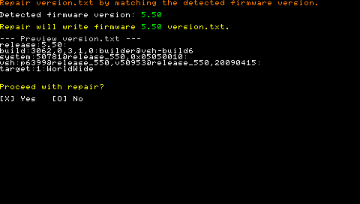

# Version.txt Switch & Repair (PSP)

**Version.txt Switch & Repair** is a PSP homebrew that allows you to easily view, switch, backup, restore, and repair the `version.txt` file on your console. This tool will let you overwrite the version.txt file in flash0 with any released firmware version.txt. 
It can be used  to fix the infamous 9.90 version error when trying to update old 5.50 custom firmware.




## Features

- **View Current and Backup version.txt**  
  Display the contents of your current and backup `version.txt` files.
- **Switch version.txt**  
  Quickly switch your `version.txt` to any official firmware version from 1.00 to 6.61. Can also set version to 9.90 to block firmware update.
- **Repair version.txt**  
  Automatically generate and write a correct `version.txt` for your detected firmware.
- **Backup/Restore**  
  Backup your current `version.txt` to `flash1`, and restore it later if needed.
- **Delete Backup**  
  Remove your backup file from `flash1`.

## Usage

1. **Installation:**  
   Copy the `VersionTxtSwitchRepair` to your PSP's `/PSP/GAME/` folder.

2. **Launch:**  
   Launch from the XMB.

3. **Navigate Menu:**  
   - Use **UP/DOWN** to move between menu items.
   - Press **X** to select.
   - Press **O** to cancel.
   - Press **START** or select "Exit" to quit.

4. **Operations:**
   - **Switch version.txt:**  
     Select, preview and write the desired firmware version.txt.
   - **Repair version.txt:**  
     Automatically matches and writes the actual firmware version.txt.
   - **Backup/Restore/Delete:**  
     Manage version.txt backup in flash1.

## Building
**Clone this repository**

**Setup the PSP SDK** (see [pspdev](https://pspdev.github.io/) for instructions).

**Create build directory:**
   ```bash
   mkdir build
   cd build
   ```
**Build using CMake:**
   ```bash
   psp-cmake..
   make
   ```

## Notes & Warnings

- **Requires PSP with Custom Firmware.**  
- **/!\ This homebrew writes directly to flash0. Use at your own risk!** 
- **Backup:**  
  Always use the backup and restore features before making changes. The app will automatically backup version.txt before overwriting it.

## Credits

- Programmed by **Wyped**
- [PSPSDK](https://github.com/pspdev/pspsdk)

## License

MIT License. See [LICENSE](LICENSE) for details.
